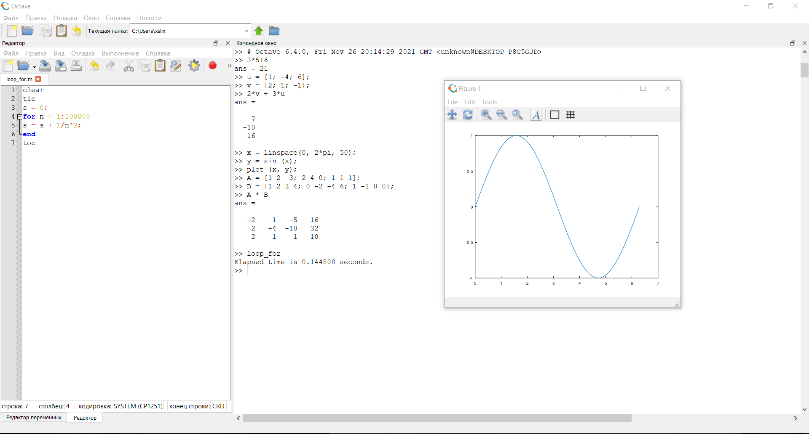

---
## Front matter
lang: ru-RU
title: Основы Octave
author: Кейела Патачона
institute: Российский Университет Дружбы Народов
date: 26 ноября, 2021, Москва, Россия

## Formatting
mainfont: PT Serif
romanfont: PT Serif
sansfont: PT Sans
monofont: PT Mono
toc: false
slide_level: 2
theme: metropolis
header-includes: 
 - \metroset{progressbar=frametitle,sectionpage=progressbar,numbering=fraction}
 - '\makeatletter'
 - '\beamer@ignorenonframefalse'
 - '\makeatother'
aspectratio: 43
section-titles: true
---

# Цели и задачи

## Цель лабораторной работы

Ознакомится с основными операциями для работы в Octave.

# Выполнение лабораторной работы

## Базовые операции в Octave

В Octave присутствуют следующие простейщие операции:

1. сложение
2. вычетание 
3. умножение 
4. деление

## Базовые операции в Octave

В Octave присутствуют следующие оперции над векторами:

1. Скалярное умножение 
2. Векторное умножение
3. Норма вектора
4. Сложение векторов

## Базовые операции в Octave

В Octave присутствуют следующие оперции с матрицами:

1. Произведение матриц
2. Сложение матриц
3. Умножение матрицы на число
4. Нахождение определителся
5. Нахождение обратной матрицы
6. Нахождение ранга матрицы
7. Действия с единичной матрицей

## Базовые операции в Octave

Также в Octave можно работать с графиками функций.Можно выводить один или несколько графиков.

Также в Octave можно  вызывать файлы в разрешением формата .м

## Контрольный пример

{ #fig:001 width=70% height=70%}

# Выводы

## Результаты выполнения лабораторной работы

Ознакомился с основными операциями для работы в Octave.