---
# Front matter
lang: ru-RU
title: "Научное програмирование"
subtitle: "Отчет по лабораторной работе № 3"
author: "Кейела Патачона НПМмд-02-21"

# Formatting
toc-title: "Содержание"
toc: true # Table of contents
toc_depth: 2
lof: true # List of figures
fontsize: 12pt
linestretch: 1.5
papersize: a4paper
documentclass: scrreprt
polyglossia-lang: russian
polyglossia-otherlangs: english
mainfont: PT Serif
romanfont: PT Serif
sansfont: PT Sans
monofont: PT Mono
mainfontoptions: Ligatures=TeX
romanfontoptions: Ligatures=TeX
sansfontoptions: Ligatures=TeX,Scale=MatchLowercase
monofontoptions: Scale=MatchLowercase
indent: true
pdf-engine: lualatex
header-includes:
  - \linepenalty=10 # the penalty added to the badness of each line within a paragraph (no associated penalty node) Increasing the value makes tex try to have fewer lines in the paragraph.
  - \interlinepenalty=0 # value of the penalty (node) added after each line of a paragraph.
  - \hyphenpenalty=50 # the penalty for line breaking at an automatically inserted hyphen
  - \exhyphenpenalty=50 # the penalty for line breaking at an explicit hyphen
  - \binoppenalty=700 # the penalty for breaking a line at a binary operator
  - \relpenalty=500 # the penalty for breaking a line at a relation
  - \clubpenalty=150 # extra penalty for breaking after first line of a paragraph
  - \widowpenalty=150 # extra penalty for breaking before last line of a paragraph
  - \displaywidowpenalty=50 # extra penalty for breaking before last line before a display math
  - \brokenpenalty=100 # extra penalty for page breaking after a hyphenated line
  - \predisplaypenalty=10000 # penalty for breaking before a display
  - \postdisplaypenalty=0 # penalty for breaking after a display
  - \floatingpenalty = 20000 # penalty for splitting an insertion (can only be split footnote in standard LaTeX)
  - \raggedbottom # or \flushbottom
  - \usepackage{float} # keep figures where there are in the text
  - \floatplacement{figure}{H} # keep figures where there are in the text
---

# Цель работы

Ознакомится с основными операциями для работы в Octave..

# Выполнение лабораторной работы

## Простейшие операции

Включим журналирование сессии. Продемонстрируем, что Octave можно использовать как простейший калькулятор. Для этого вычислим выражение, зададим вектор и ковектор, а также матрицу.

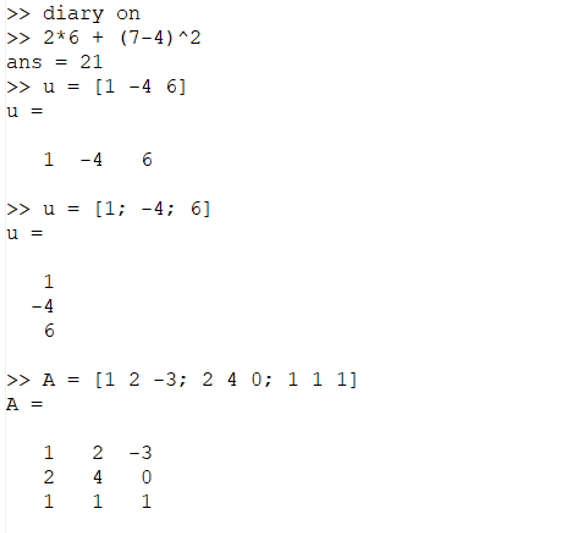{ #fig:001 width=70% height=70%}

## Операции с векторами

Зададим два вектора-столбца, выполним операции сложения векторов, Скалярное умножение, Векторное умножение и вычислим норму вектора.

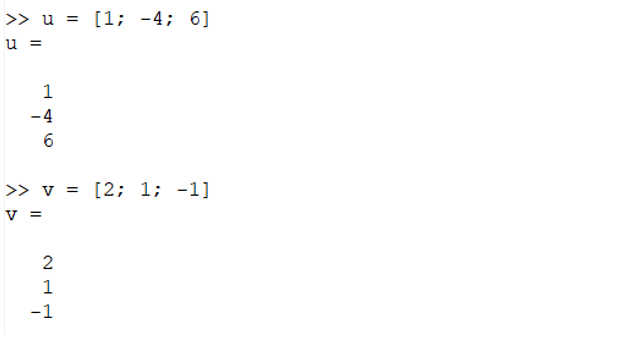{ #fig:002 width=70% height=70%}

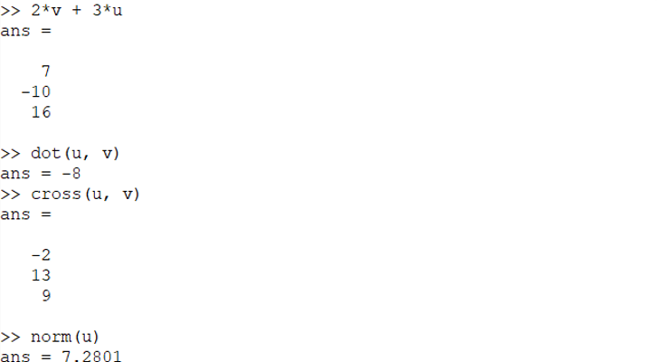{ #fig:003 width=70% height=70%}

## Вычисление проектора

Введём два вектора-строки. Вычислим проекцию вектора u на вектор v.

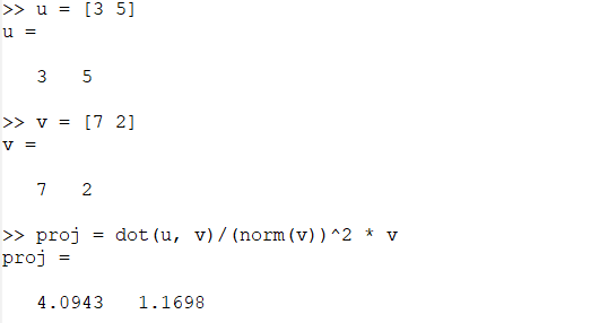{ #fig:004 width=70% height=70%}

##	Матричные операции

Введём матрицы A и B. Вычислим произведение матриц AB, затем вычислим произведение матриц B^TA. Вычислим 2A − 4I. Найдём определитель | A |, обратную матрицу A−1, собственные значения и ранг матрицы.

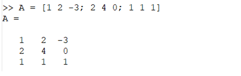{ #fig:005 width=70% height=70%}

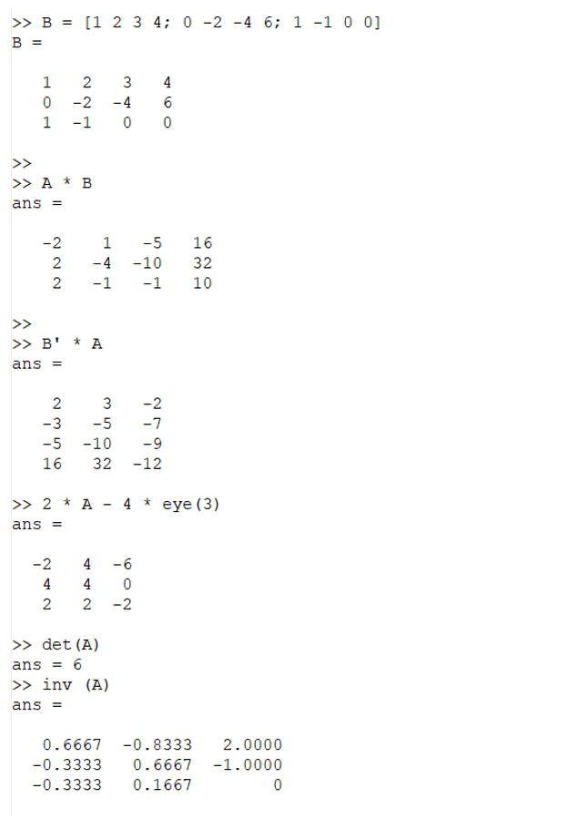{ #fig:006 width=70% height=70%}

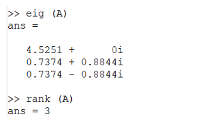{ #fig:007 width=70% height=70%}

##	Построение простейших графиков

Построим график функции sin x на интервале [0, 2π]. Создадим вектор значений x, зададим вектор y = sin x, построим график. В результате получим следующий график. Затем улучшим внешний вид графика. Зададим красный цвет для линии и сделаем её потолще, подгоним диапазон осей, нарисуем сетку, подпишем оси, сделаем заголовок графика и зададим легенду.

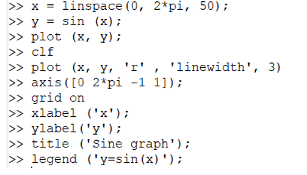{ #fig:008 width=70% height=70%}

Сначала был получен следующий график:

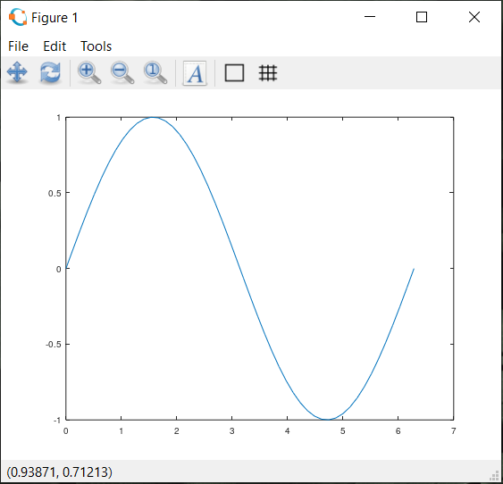{ #fig:009 width=70% height=70%}

Затем получили более красивый и наглядный график заданной функции:

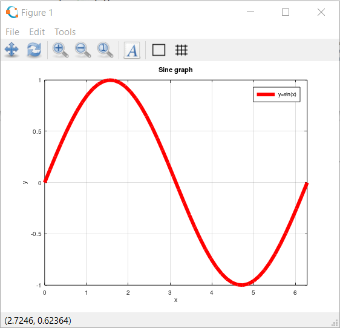{ #fig:010 width=70% height=70%}

### 6.	Два графика на одном чертеже

Для того чтобы начертить два графика на одном чертеже, нужно использовать команду hold on. Сделаем один график, затем добавим график регрессии, зададим сетку, оси и легенду.

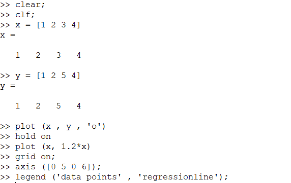{ #fig:011 width=70% height=70%}

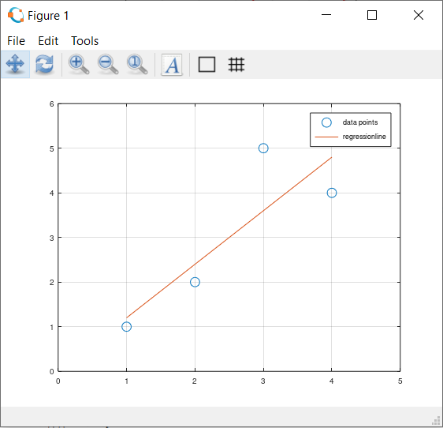{ #fig:012 width=70% height=70%}

## График y=x^2 sin x

Зададим вектор x (0, 2pi). Построим график y=x^2 sin x, используя поэлементное возведение в степень и поэлементное умножение. Сохраним графики в виде файлов.

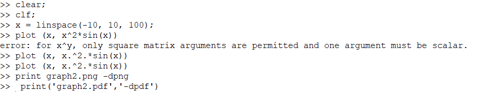{ #fig:013 width=70% height=70%}

{ #fig:014 width=70% height=70%}

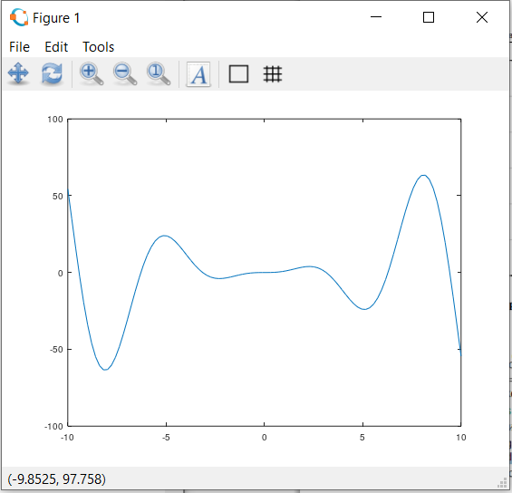{ #fig:015 width=70% height=70%}

## Сравнение циклов и операций с векторами 
Сравним эффективность работы с циклами и операций с векторами. Для этого вычислим сумму:

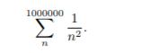{ #fig:016 width=70% height=70%}

Очистим память и рабочую область фигуры, вычислим сумму с помощью цикла, создадим файл loop_for.m, функции tic и toc служат для запуска и остановки таймера, запустим файл loop_for.m. Вычислим сумму с помощью операций с векторами. Создадим файл loop_vec.m, запустим его. Завершим запись в файл.

Ниже мы можем наблюдать, что с помощью векторов компьютер вычисляет заданную сумму намного быстрее. 

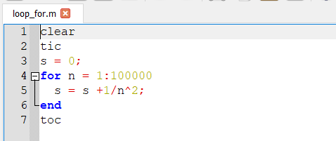{ #fig:017 width=70% height=70%}

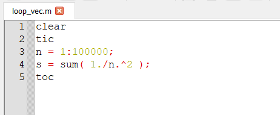{ #fig:018 width=70% height=70%}

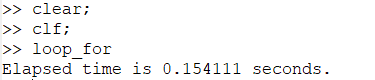{ #fig:019 width=70% height=70%}

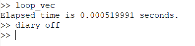{ #fig:020 width=70% height=70%}

# Вывод

В ходе выполнения данной работы я ознакомился с основными операциями для работы в Octave. 