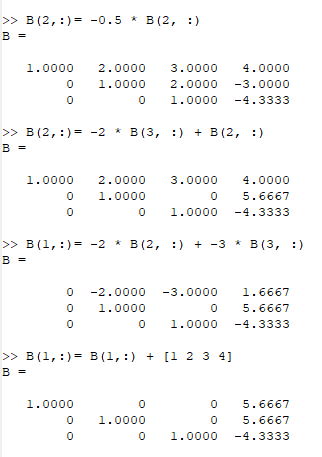
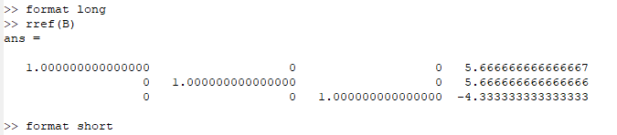
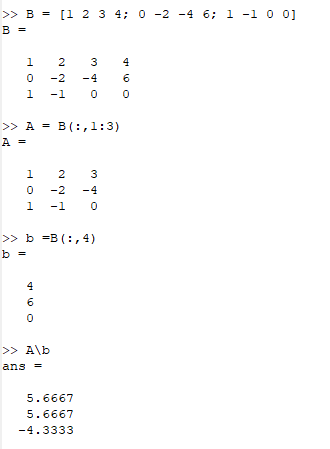

---
## Front matter
lang: ru-RU
title: Решение систем линейных уравнений
author: Кейела Патачона
institute: Российский Университет Дружбы Народов
date: 04 декабря, 2021, Москва, Россия

## Formatting
mainfont: PT Serif
romanfont: PT Serif
sansfont: PT Sans
monofont: PT Mono
toc: false
slide_level: 2
theme: metropolis
header-includes: 
 - \metroset{progressbar=frametitle,sectionpage=progressbar,numbering=fraction}
 - '\makeatletter'
 - '\beamer@ignorenonframefalse'
 - '\makeatother'
aspectratio: 43
section-titles: true
---

# Цели и задачи

## Цель лабораторной работы

Решение систем линейных уравнений на языке программирования Octave

# Выполнение лабораторной работы

## Метод Гаусса

Включим журналирование сессии и  Используя элементарные преобразования и свойства векторного языка программирования Octqve мы решили методом Гаусса систему линейных уравнений.

{ #fig:001 width=70% height=70%}

{ #fig:002 width=70% height=70%}

{ #fig:003 width=70% height=70%}

{ #fig:004 width=70% height=70%}

{ #fig:005 width=70% height=70%}

## Метода левого деления

Используем встроенную команду в Octave чтобы решить систему линейных уравнений.

{ #fig:006 width=70% height=70%}

## Метод LU-разложения

С помощью Octave распишем LU-разложение матриц, мы решаем систему уравнений. 

{ #fig:007 width=70% height=70%}

{ #fig:008 width=70% height=70%}

## Метод LUP-разложения

Если используются чередования строк, то матрица A умножается на матрицу перестановок, и разложение принимает форму $PA = LU$

{ #fig:009 width=70% height=70%}

## Контрольный пример

{ #fig:010 width=70% height=70%}

# Выводы

## Результаты выполнения лабораторной работы

В ходе выполнения данной работы я научился решить системы линейных уравнений разными методами в Octave.