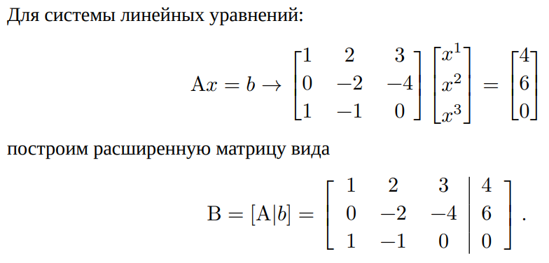
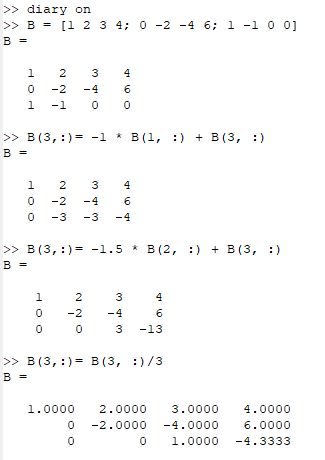
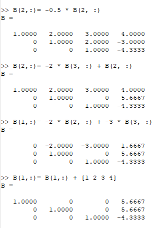
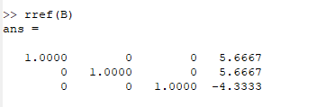
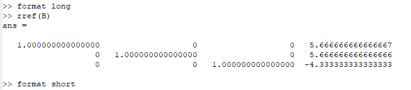
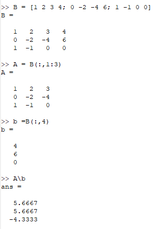
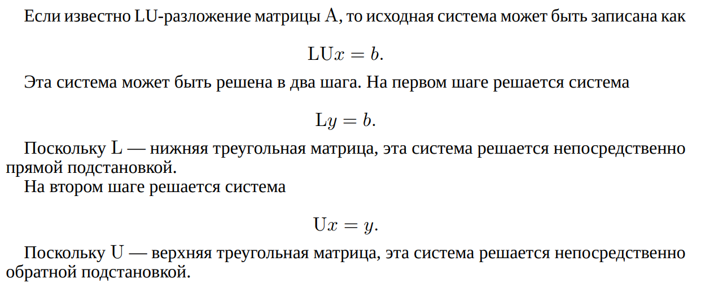
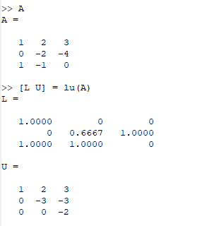
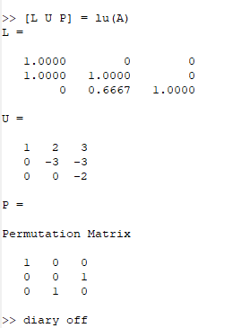

---
# Front matter
lang: ru-RU
title: "Научное програмирование"
subtitle: "Отчет по лабораторной работе № 4"
author: "Кейела Патачона НПМмд-02-21"

# Formatting
toc-title: "Содержание"
toc: true # Table of contents
toc_depth: 2
lof: true # List of figures
fontsize: 12pt
linestretch: 1.5
papersize: a4paper
documentclass: scrreprt
polyglossia-lang: russian
polyglossia-otherlangs: english
mainfont: PT Serif
romanfont: PT Serif
sansfont: PT Sans
monofont: PT Mono
mainfontoptions: Ligatures=TeX
romanfontoptions: Ligatures=TeX
sansfontoptions: Ligatures=TeX,Scale=MatchLowercase
monofontoptions: Scale=MatchLowercase
indent: true
pdf-engine: lualatex
header-includes:
  - \linepenalty=10 # the penalty added to the badness of each line within a paragraph (no associated penalty node) Increasing the value makes tex try to have fewer lines in the paragraph.
  - \interlinepenalty=0 # value of the penalty (node) added after each line of a paragraph.
  - \hyphenpenalty=50 # the penalty for line breaking at an automatically inserted hyphen
  - \exhyphenpenalty=50 # the penalty for line breaking at an explicit hyphen
  - \binoppenalty=700 # the penalty for breaking a line at a binary operator
  - \relpenalty=500 # the penalty for breaking a line at a relation
  - \clubpenalty=150 # extra penalty for breaking after first line of a paragraph
  - \widowpenalty=150 # extra penalty for breaking before last line of a paragraph
  - \displaywidowpenalty=50 # extra penalty for breaking before last line before a display math
  - \brokenpenalty=100 # extra penalty for page breaking after a hyphenated line
  - \predisplaypenalty=10000 # penalty for breaking before a display
  - \postdisplaypenalty=0 # penalty for breaking after a display
  - \floatingpenalty = 20000 # penalty for splitting an insertion (can only be split footnote in standard LaTeX)
  - \raggedbottom # or \flushbottom
  - \usepackage{float} # keep figures where there are in the text
  - \floatplacement{figure}{H} # keep figures where there are in the text
---

# Цель работы

Решение систем линейных уравнений на языке программирования Octave

# Выполнение лабораторной работы

## Метод Гаусса

Включим журналирование сессии и  Используя элементарные преобразования и свойства векторного языка программирования Octqve мы решили методом Гаусса систему линейных уравнений.

{ #fig:001 width=70% height=70%}

{ #fig:002 width=70% height=70%}

{ #fig:003 width=70% height=70%}

{ #fig:004 width=70% height=70%}

{ #fig:005 width=70% height=70%}

## Метода левого деления

Используем встроенную команду в Octave чтобы решить систему линейных уравнений.

{ #fig:006 width=70% height=70%}

## Метод LU-разложения

С помощью Octave распишем LU-разложение матриц, мы решаем систему уравнений. 

{ #fig:007 width=70% height=70%}

{ #fig:008 width=70% height=70%}

## Метод LUP-разложения

Если используются чередования строк, то матрица A умножается на матрицу перестановок, и разложение принимает форму $PA = LU$

{ #fig:009 width=70% height=70%}

# Вывод

В ходе выполнения данной работы я научился решить системы линейных уравнений разными методами в Octave. 