---
## Front matter
lang: ru-RU
title:  Подгонка полиномиальной кривой и Матричные преобразования.
author: Кейела Патачона
institute: Российский Университет Дружбы Народов
date: 11 декабря, 2021, Москва, Россия

## Formatting
mainfont: PT Serif
romanfont: PT Serif
sansfont: PT Sans
monofont: PT Mono
toc: false
slide_level: 2
theme: metropolis
header-includes: 
 - \metroset{progressbar=frametitle,sectionpage=progressbar,numbering=fraction}
 - '\makeatletter'
 - '\beamer@ignorenonframefalse'
 - '\makeatother'
aspectratio: 43
section-titles: true
---

# Цели и задачи

## Цель лабораторной работы

Ознакомление с некоторыми операциями в среде Octave для решения таких задач, как подгонка полиномиальной кривой, матричных преобразований, вращений, отражений и дилатаций.

# Выполнение лабораторной работы

## Подгонка полиномиальной кривой

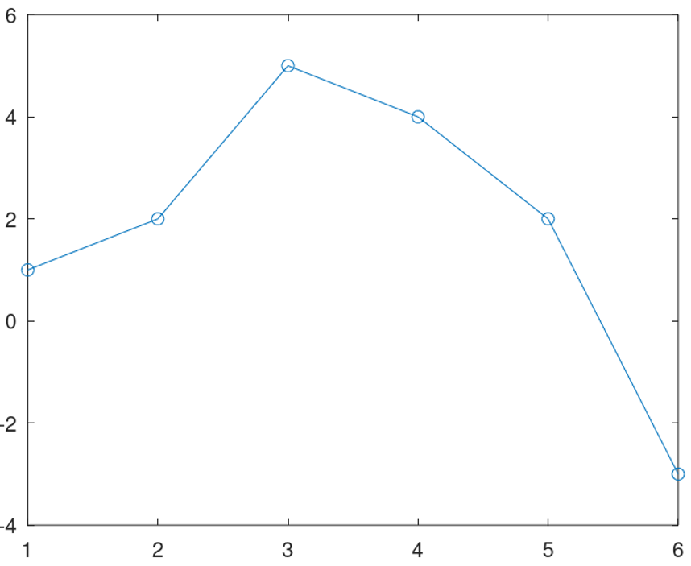{ #fig:01 width=30% height=30%}

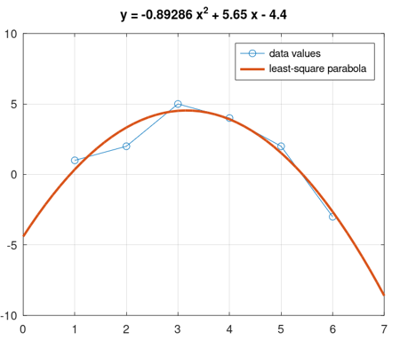{ #fig:02 width=30% height=30%}

## Подгонка полиномиальной кривой

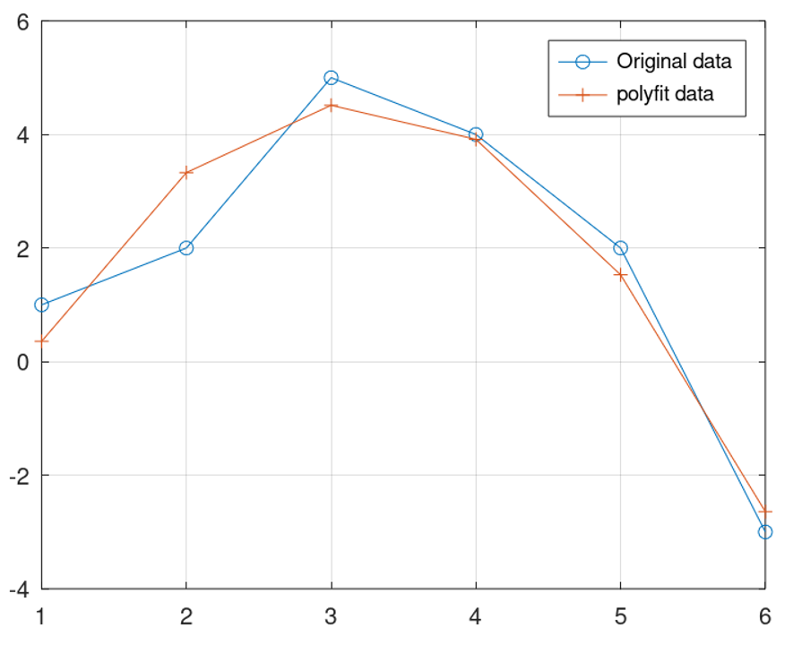{ #fig:03 width=50% height=50%}

## Матричные преобразования  

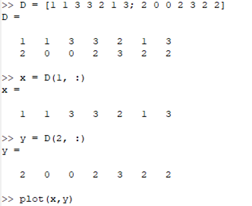{ #fig:04 width=30% height=30%}

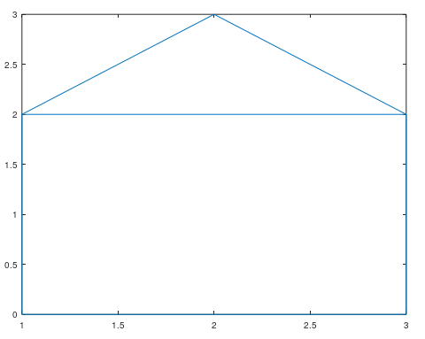{ #fig:05 width=40% height=40%}

## Вращение 
 
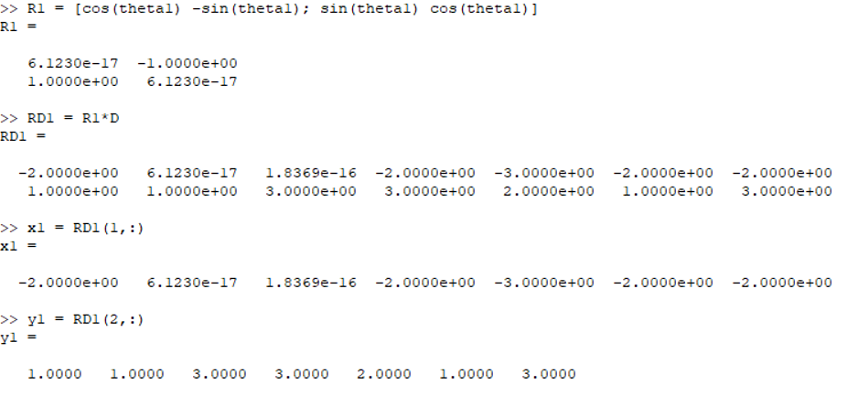{ #fig:07 width=40% height=40%}

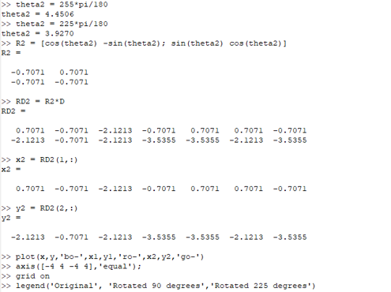{ #fig:08 width=40% height=40%}

## Вращение 

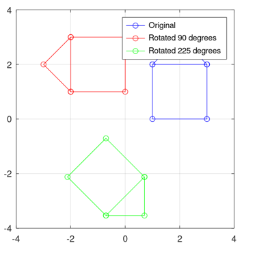{ #fig:09 width=50% height=50%}

## Отражение  

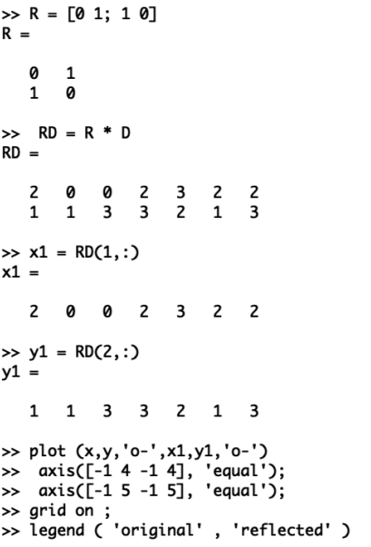{ #fig:10 width=40% height=40%}

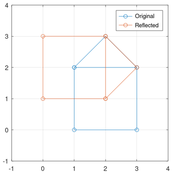{ #fig:11 width=40% height=40%}

## Дилатация  

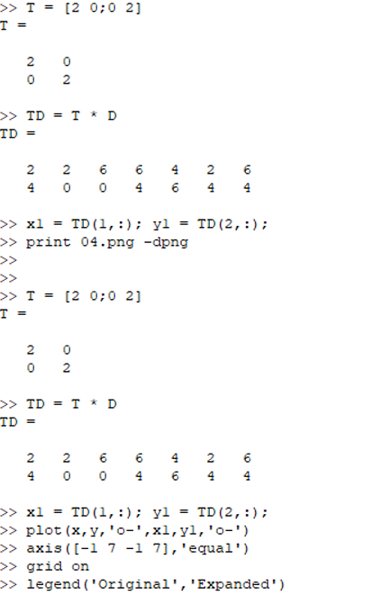{ #fig:12 width=40% height=40%}

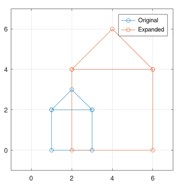{ #fig:13 width=40% height=40%}

# Выводы

## Результаты выполнения лабораторной работы

В ходе выполнения данной работы я ознакомился с некоторыми операциями в среде Octave для решения таких задач, как подгонка полиномиальной кривой, матричных преобразованийЖ: вращений, отражений и дилатаций.