---
# Front matter
lang: ru-RU
title: "Научное програмирование"
subtitle: "Отчет по лабораторной работе № 5"
author: "Кейела Патачона НПМмд-02-21"

# Formatting
toc-title: "Содержание"
toc: true # Table of contents
toc_depth: 2
lof: true # List of figures
fontsize: 12pt
linestretch: 1.5
papersize: a4paper
documentclass: scrreprt
polyglossia-lang: russian
polyglossia-otherlangs: english
mainfont: PT Serif
romanfont: PT Serif
sansfont: PT Sans
monofont: PT Mono
mainfontoptions: Ligatures=TeX
romanfontoptions: Ligatures=TeX
sansfontoptions: Ligatures=TeX,Scale=MatchLowercase
monofontoptions: Scale=MatchLowercase
indent: true
pdf-engine: lualatex
header-includes:
  - \linepenalty=10 # the penalty added to the badness of each line within a paragraph (no associated penalty node) Increasing the value makes tex try to have fewer lines in the paragraph.
  - \interlinepenalty=0 # value of the penalty (node) added after each line of a paragraph.
  - \hyphenpenalty=50 # the penalty for line breaking at an automatically inserted hyphen
  - \exhyphenpenalty=50 # the penalty for line breaking at an explicit hyphen
  - \binoppenalty=700 # the penalty for breaking a line at a binary operator
  - \relpenalty=500 # the penalty for breaking a line at a relation
  - \clubpenalty=150 # extra penalty for breaking after first line of a paragraph
  - \widowpenalty=150 # extra penalty for breaking before last line of a paragraph
  - \displaywidowpenalty=50 # extra penalty for breaking before last line before a display math
  - \brokenpenalty=100 # extra penalty for page breaking after a hyphenated line
  - \predisplaypenalty=10000 # penalty for breaking before a display
  - \postdisplaypenalty=0 # penalty for breaking after a display
  - \floatingpenalty = 20000 # penalty for splitting an insertion (can only be split footnote in standard LaTeX)
  - \raggedbottom # or \flushbottom
  - \usepackage{float} # keep figures where there are in the text
  - \floatplacement{figure}{H} # keep figures where there are in the text
---

# Цель работы
Решение проблемы подгонки полинома к множеству точек и изучение матричные преобразования.

# Подгонка полиномиальной кривой
В статистике часто рассматривается проблема подгонки прямой линии к набору данных. Решим более общую проблему подгонки полинома к множеству точек. Пусть нам нужно найти параболу по методу наименьших квадратов для набора точек, заданных матрицей
$$ D = \begin{pmatrix} 1&1\\2&2\\3&5\\4&4\\5&2\\6&-3 \end{pmatrix} $$

В матрице заданы значения $𝑥$ в столбце 1 и значения $𝑦$ в столбце 2.

Введём матрицу данных в Octave и извлечём вектора $𝑥$ и $y$.

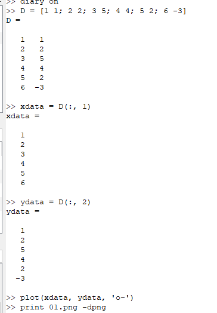{ #fig:01 width=100% height=45%}

Нарисуем точки на графике.

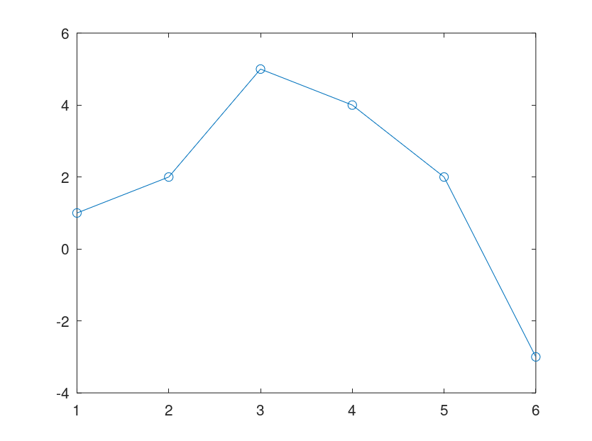{ #fig:02 width=70% height=70%}

Построим уравнение вида $𝑦 = 𝑎𝑥^2 + 𝑏𝑥 + 𝑐$
Подставляя данные, получаем следующую систему линейных уравнений

$$\begin{pmatrix} 1&1 & 1 \\ 4 & 2 & 1\\ 9 & 3 & 1 \\  16 & 4 & 1 \\ 25 & 5 & 1 \\ 36 & 6 & 1 \end{pmatrix}
\begin{pmatrix} a \\ b \\ c \end{pmatrix} =
\begin{pmatrix} 1\\2\\5\\4\\2\\-3 \end{pmatrix}
$$

Обращаем внимание на форму матрицы коэффициентов $A$. Третий столбец – все единицы, второй столбец – значения $𝑥$, а первый столбец – квадрат значений $𝑥$. Правый вектор – это значения $y$. Есть несколько способов построить матрицу коэффициентов в Octave. Один из подходов состоит в том, чтобы использовать команду $ones$ для создания матрицы единиц соответствующего размера, а затем перезаписать первый и второй столбцы необходимыми данными.

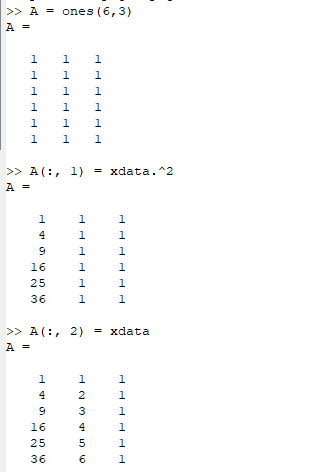{ #fig:03 width=100% height=45%}

Решение по методу наименьших квадратов получается из решения уравнения $𝐴^𝑇𝐴𝑏 = 𝐴^𝑇𝑦$, где $𝑏$ – вектор коэффициентов полинома. Используем Octave для построения уравнений. Запишем расширенную матрицу для решения задачи методом Гаусса.

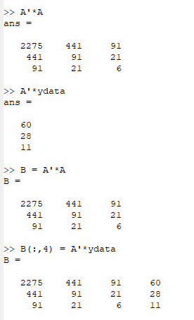{ #fig:04 width=70% height=45%}

Таким образом, искомое квадратное уравнение имеет вид
$$ 𝑦 = −0.89286𝑥^2 + 5.65𝑥 − 4.4 $$.
Построим соответствующий график параболы.

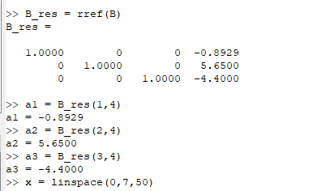{ #fig:05 width=70% height=70%}

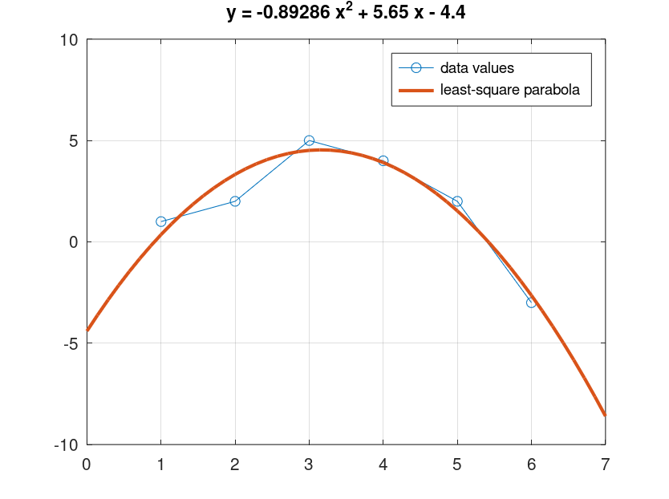{ #fig:06 width=70% height=70%}

Процесс подгонки может быть автоматизирован встроенными функциями Octave. Для этого мы можем использовать встроенную функцию для подгонки полинома $polyfit$. Синтаксис: $polyfit (x, y, order)$, где $order$ – это степень полинома. Значения полинома $P$ в точках, задаваемых вектором-строкой $x$ можно получить с помощью функции $polyval$. Синтаксиса: $polyval (P, x)$.
Получим подгоночный полином.

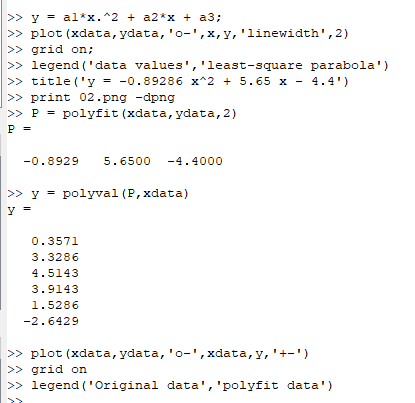{ #fig:07 width=70% height=45%}

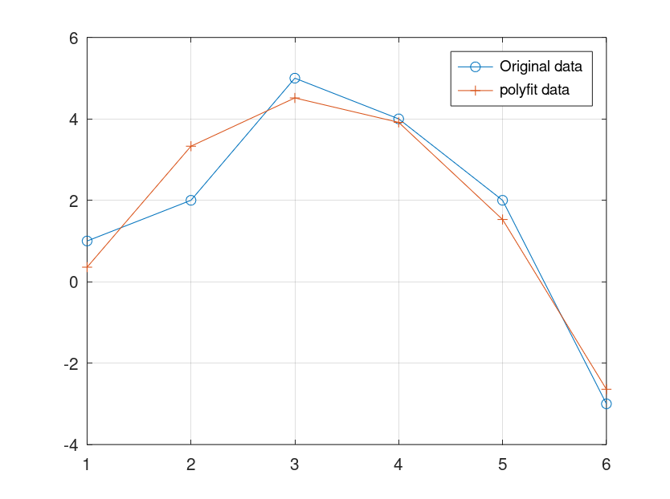{ #fig:08 width=70% height=70%}

#	Матричные преобразования
Матрицы и матричные преобразования играют ключевую роль в компьютерной графике. Существует несколько способов представления изображения в виде матрицы. Подход, который мы здесь используем, состоит в том, чтобы перечислить ряд вершин, которые соединены последовательно, чтобы получить ребра простого графа. Мы записываем это как матрицу $2 × 𝑛$, где каждый столбец представляет точку на рисунке. В качестве простого примера, давайте попробуем закодировать граф-домик. Есть много способов закодировать это как матрицу. Эффективный метод состоит в том, чтобы выбрать путь, который проходит по каждому ребру ровно один раз (цикл Эйлера).

$$
D = \begin{pmatrix} 1 & 1 & 3 & 3 & 2 & 1 & 3 \\ 2 & 0 & 0 & 2 & 3 & 2 & 2 \end{pmatrix}
$$

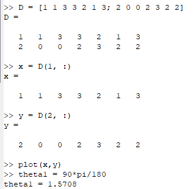{ #fig:09 width=70% height=70%}

## Вращение
Рассмотрим различные способы преобразования изображения. Вращения могут быть получены с использованием умножения на специальную матрицу. Вращение точки $(𝑥, 𝑦)$ относительно начала координат определяется как

$$ R \begin{pmatrix} x \\ y \end{pmatrix} $$ где
$$ R = \begin{pmatrix} \cos(\theta) & -\sin(\theta) \\ \sin(\theta) & \cos(\theta) \end{pmatrix} $$

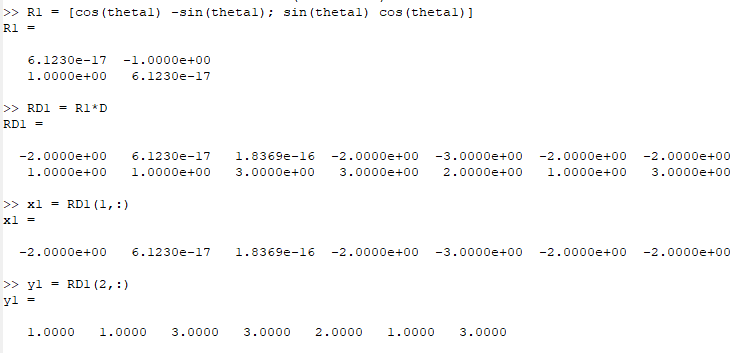{ #fig:10 width=70% height=70%}

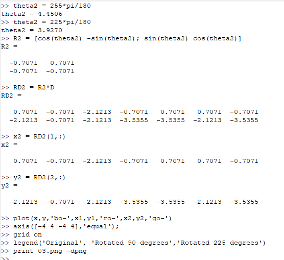{ #fig:11 width=70% height=70%}

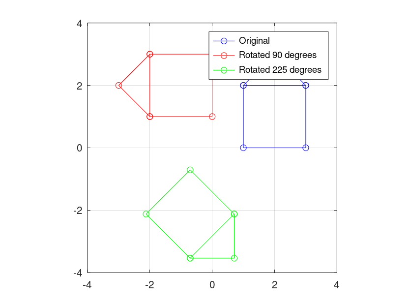{ #fig:12 width=70% height=70%}

## Отражение
Если $l$ – прямая, проходящая через начало координат, то отражение точки $(𝑥, 𝑦)$ относительно прямой $l$ определяется как
$$ R \begin{pmatrix} x \\ y \end{pmatrix} $$ где
$$ R = \begin{pmatrix} \cos(2\theta) & \sin(2\theta) \\ \sin(2\theta) & -\cos(2\theta) \end{pmatrix} $$
$\theta$ – угол между прямой $l$ и осью абсцисс (измеренный против часовой стрелки).
Отразим граф дома относительно прямой $𝑦 = 𝑥$. Зададим матрицу
отражения (поясните, почему она такая).

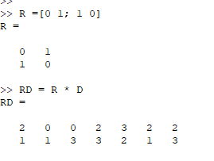{ #fig:13 width=70% height=70%}

{ #fig:14 width=70% height=70%}

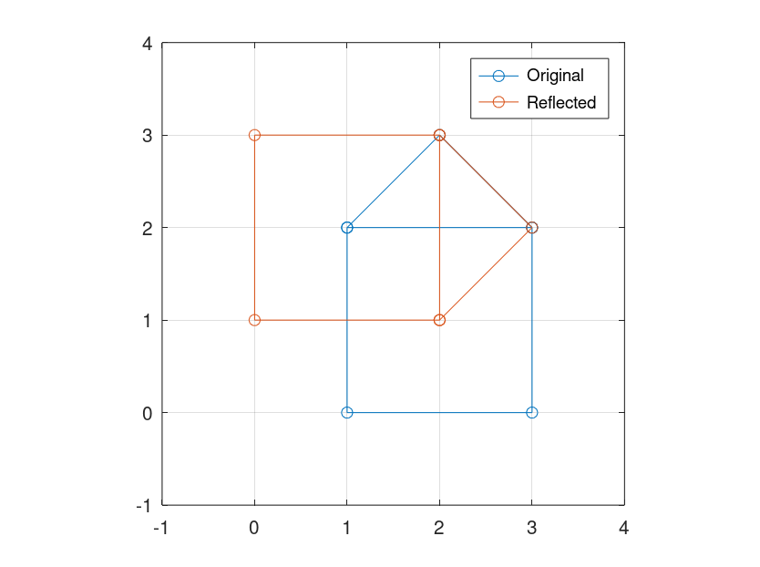{ #fig:15 width=70% height=70%}

## Дилатация
Дилатация (то есть расширение или сжатие) также может быть выполнено путём умножения матриц. Пусть

$$ R = \begin{pmatrix} k & 0 \\ 0 & k \end{pmatrix} $$

Тогда матричное произведение $𝑇𝐷$ будет преобразованием дилатации $𝐷$ с коэффициентом $𝑘$. Увеличим граф дома в 2 раза.

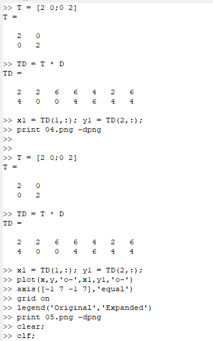{ #fig:16 width=70% height=70%}

{ #fig:17 width=70% height=45%}

# Вывод
В ходе выполнения данной работы я научился решить задачу подгонки и работать с матричными преобразованиями.

