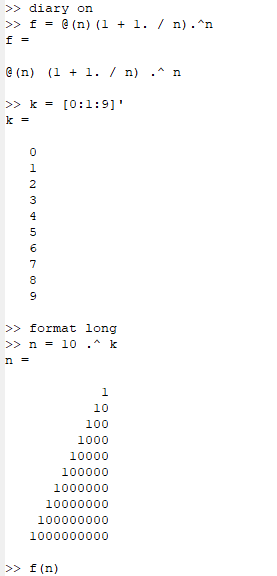
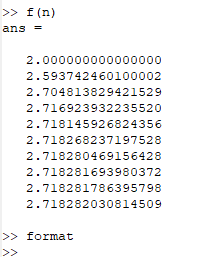
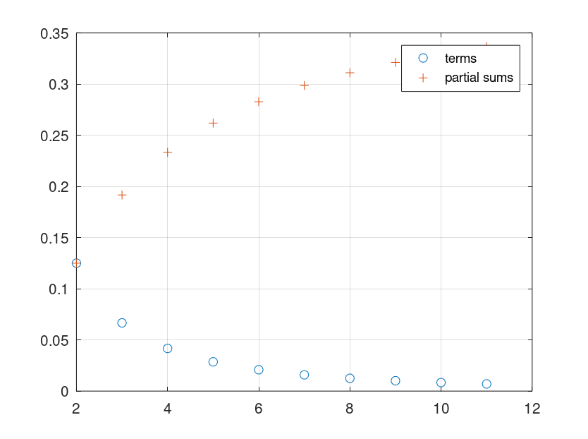
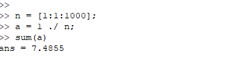
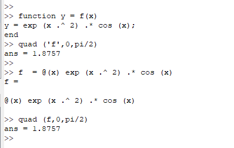
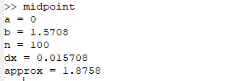
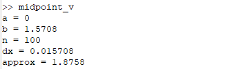
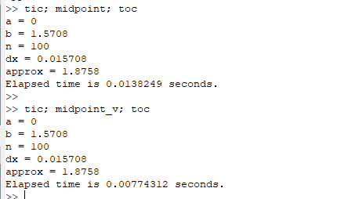

---
## Front matter
lang: ru-RU
title: Лабораторная работа №6 - Пределы, последовательности и интеграли
author: Кейела Патачона
institute: Российский Университет Дружбы Народов
date: 15 декабря, 2021, Москва, Россия

## Formatting
mainfont: PT Serif
romanfont: PT Serif
sansfont: PT Sans
monofont: PT Mono
toc: false
slide_level: 2
theme: metropolis
header-includes: 
 - \metroset{progressbar=frametitle,sectionpage=progressbar,numbering=fraction}
 - '\makeatletter'
 - '\beamer@ignorenonframefalse'
 - '\makeatother'
aspectratio: 43
section-titles: true
---

# Цели и задачи

***Цель лабораторной работы***

Вычисление пределов, сумм рядов и интегралов.

***Задача***

На языке Octave определить предел, частичные суммы рядов, вычислить интеграл с помощью различных реализаций и сравнить время выполнения этих реализаций.

# Выполнение лабораторной работы 

## Вычисление предела
Рассмотрим предел
$$
\lim_{n \to \infty}\Big(1+ \frac{1}{n}\Big)^{n}
$$

## Вычисление предела

{ #fig:001 width=30% height=30%}

{ #fig:002 width=40% height=40%}

## Частичные суммы

Пусть $a=\sum_{n=2}^{\infty}a_{n}$-ряд, n-й член равен $$ a_{n}= \frac{1}{n(n+2)}$$

{ #fig:003 width=40% height=40%}

## Сумма ряда

Найдём сумму первых 1000 членов гармонического ряда: $$ \sum_{n=1}^{1000} \frac{1}{n} $$
Нам нужно только сгенерировать члены как ряда вектор, а затем взять их сумму.

{ #fig:004}

# Численное интегрирование

## Встроенная функция

Octavе имеет несколько встроенных функций для вычисления определённых интегралов. Мы будем использовать команду $quad$ (сокращение от слова квадратура).
Вычислим интеграл: $ \int_{0}^{\pi/2}e^{x^{2}}cos(x)dx $

{ #fig:005 width=40% height=40%}

## Правило средней точки

Правило средней точки, правило трапеции и правило Симпсона являются общими алгоритмами, используемыми для численного интегрирования.Напишем скрипт, чтобы вычислить интеграл $ \int_{0}^{\pi/2} e^{x^{2}} cos(x)dx$ по правилу средней точки для $n=100$.Стратегия заключается в использовании цикла, который добавляет значение функции к промежуточной сумме с каждой итерацией. В конце сумма умножается на $dx$
{ #fig:006 width=50% height=50%}

## Правило средней точки

Традиционный код работает хорошо, но поскольку Octave является векторным языком, также можно писать векторизованный код, который не требует каких-либо циклов. Создадим вектор r-координат средних точек. Затем мы оцениваем f по этому вектору средней точки, чтобы получить вектор значений функции. Аппроксимация средней точки – это сумма компонент вектора, умноженная на $dx$.

{ #fig:006 width=70% height=70%}

## Сравнение методов

Сравнили время выполнения для каждой реализации, и векторная реализация работает быстрее.

{ #fig:007 width=50% height=50%}

# Вывод 

В ходе выполнения данной работы мы ознакомились с вычислением пределов, с работой с последавательностями и с рядами и научились посчитать определенные интеграли с помощью различных методов на языке Octave.