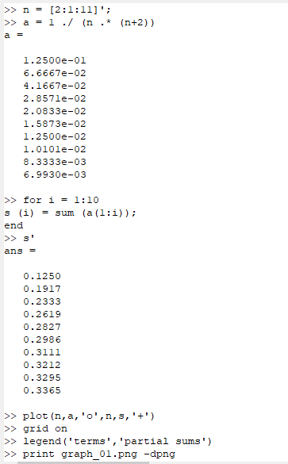
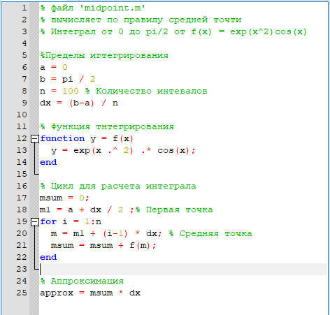
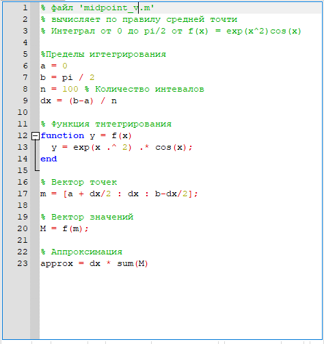

---
# Front matter
lang: ru-RU
title: "Научное програмирование"
subtitle: "Лабораторная работа № 6"
author: "Кейела Патачона, НПМмд-02-21"

# Formatting
toc-title: "Содержание"
toc: true # Table of contents
toc_depth: 2
lof: true # List of figures
fontsize: 12pt
linestretch: 1.5
papersize: a4paper
documentclass: scrreprt
polyglossia-lang: russian
polyglossia-otherlangs: english
mainfont: PT Serif
romanfont: PT Serif
sansfont: PT Sans
monofont: PT Mono
mainfontoptions: Ligatures=TeX
romanfontoptions: Ligatures=TeX
sansfontoptions: Ligatures=TeX,Scale=MatchLowercase
monofontoptions: Scale=MatchLowercase
indent: true
pdf-engine: lualatex
header-includes:
  - \linepenalty=10 # the penalty added to the badness of each line within a paragraph (no associated penalty node) Increasing the value makes tex try to have fewer lines in the paragraph.
  - \interlinepenalty=0 # value of the penalty (node) added after each line of a paragraph.
  - \hyphenpenalty=50 # the penalty for line breaking at an automatically inserted hyphen
  - \exhyphenpenalty=50 # the penalty for line breaking at an explicit hyphen
  - \binoppenalty=700 # the penalty for breaking a line at a binary operator
  - \relpenalty=500 # the penalty for breaking a line at a relation
  - \clubpenalty=150 # extra penalty for breaking after first line of a paragraph
  - \widowpenalty=150 # extra penalty for breaking before last line of a paragraph
  - \displaywidowpenalty=50 # extra penalty for breaking before last line before a display math
  - \brokenpenalty=100 # extra penalty for page breaking after a hyphenated line
  - \predisplaypenalty=10000 # penalty for breaking before a display
  - \postdisplaypenalty=0 # penalty for breaking after a display
  - \floatingpenalty = 20000 # penalty for splitting an insertion (can only be split footnote in standard LaTeX)
  - \raggedbottom # or \flushbottom
  - \usepackage{float} # keep figures where there are in the text
  - \floatplacement{figure}{H} # keep figures where there are in the text
---
# Цель работы

Вычисление пределов, сумм рядов и интегралов

# Пределы, последовательности и ряды

Octave - полноценный язык программирования, поддерживающий множество типов циклов и условных операторов. Однако, поскольку то векторный язык, многие вещи, которые можно было бы сделать с помощью циклов, можно векторизовать. Под векторизованным кодом мы понимаем следующее: вместо того, чтобы писать цикл для многократной оценки функции, мы сгенерируем вектор входных значений, а затем оценим функцию с использованием векторного ввода. В результате получается код, который легче читать и понимать, и он выполняется быстрее благодаря эффективным алгоритмам для матричных операций.

## Пределы

Рассмотрим предел:
$$
\lim_{n \to \infty}\Big(1+ \frac{1}{n}\Big)^{n}
$$
Мы оценим это выражение.
Сначала определим функцию. Есть несколько способов сделать это. Метод, который мы здесь используем, называется анонимной функцией. Это хороший способ быстро определить простую функцию.

{ #fig:001 width=70% height=70%}

Обращаем внимание на использование поэлементных операций. Мы назвали функцию $f$. Входная переменная обозначается знаком @, за которым следует переменная в скобках. Следующее выражение будет использоваться при оценке функции. Теперь $f$ можно использовать как любую функцию в Octave.
Далее мы создали индексную переменную, состоящую из целых чисел от 0 до 9 и взяли степени 10, которые будут входными значениями, а затем оценили $f(n)$.

{ #fig:002 width=70% height=70%}

Предел сходится к конечному значению, которое составляет приблизительно $2,71828...$ Подобные методы могут быть использованы для численного исследования последовательностей и рядов.

## Частичные суммы
Пусть $a=\sum_{n=2}^{\infty}a_n-$ ряд, $n-$й член равен $$ a_{n}= \frac{1}{n(n+2)}$$
Для этого мы определим индексный вектор пот 2 до 11, а затем вычислим члены.
Если мы хотим знать частичную сумму, нам нужно только написать $sum(a)$. Если мы хотим получить последовательность частичных сумм, нам нужно использовать цикл. Мы будем использовать цикл for c индексом і от 1 до 10. Для каждого і мы получим частичную сумму последовательности а от первого слагаемого до і-го слагаемого. На выходе получается 10-элементный вектор этих частичных сумм.

{ #fig:003 width=60% height=60%}

{ #fig:004 width=60% height=60%}

## Сумма ряда

Найдём сумму первых 1000 членов гармонического ряда: $$ \sum_{n=1}^{1000} \frac{1}{n} $$
Нам нужно только сгенерировать члены как ряда вектор, а затем взять их сумму.

{ #fig:005}

# Численное интегрирование

## Встроенная функция

Octavе имеет несколько встроенных функций для вычисления определённых интегралов. Мы будем использовать команду $quad$ (сокращение от слова квадратура).

Вычислим интеграл:

$$ \int_{0}^{\pi/2}e^{x^{2}}cos(x)dx $$

Синтаксис команды — $quadc('f' ,a,b)$. Нам нужно сначала определить функцию. 

{ #fig:006 width=70% height=70%}

Обращаем внимание, что функция $exp(x)$ используется для $e$. Мы использовали конструкцию $function ... end$. Кавычки вокруг имени f не используются, если используется анонимная функция.

## Правило средней точки

Правило средней точки, правило трапеции и правило Симпсона являются общими алгоритмами, используемыми для численного интегрирования.
Напишем скрипт, чтобы вычислить интеграл

$$ \int_{0}^{\pi/2} e^{x^{2}}cos(x)dx$$

по правилу средней точки для $n=100$.
Стратегия заключается в использовании цикла, который добавляет значение функции к промежуточной сумме с каждой итерацией. В конце сумма умножается на $dx$

{ #fig:007 width=50% height=50%}

{ #fig:008 width=70% height=70%}

Традиционный код работает хорошо, но поскольку Octave является векторным языком, также можно писать векторизованный код, который не требует каких-либо циклов.
Создадим вектор r-координат средних точек. Затем мы оцениваем f по этому вектору средней точки, чтобы получить вектор значений функции. Аппроксимация средней точки – это сумма компонент вектора, умноженная на $dx$.

{ #fig:009 width=50% height=50%}

{ #fig:010 width=70% height=70%}

## Сравнение методов

Сравнили время выполнения для каждой реализации, и векторная реализация работает быстрее.

{ #fig:011 width=70% height=70%}

# Вывод 

В ходе выполнения данной работы мы ознакомились с вычислением пределов, с работой с последавательностями и с рядами и научились посчитать определенные интеграли с помощью различных методов на языке Octave.

# Список литературы{.unnumbered}

1. [Инструкция к лабораторной работе №6](https://esystem.rudn.ru/mod/resource/view.php?id=795800)
