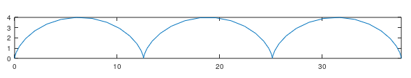

---
## Front matter
lang: ru-RU
title: Лабораторная работа №7 - Графики.
author: Кейела Патачона, НПМмд-02-21
institute: РУДН, Москва, Россия

date: 24 декабря 2021

## Formatting
mainfont: PT Serif
romanfont: PT Serif
sansfont: PT Sans
monofont: PT Mono
toc: false
slide_level: 2
theme: metropolis
header-includes: 
 - \metroset{progressbar=frametitle,sectionpage=progressbar,numbering=fraction}
 - '\makeatletter'
 - '\beamer@ignorenonframefalse'
 - '\makeatother'
aspectratio: 43
section-titles: true
---

# Построение графиков.

***Цель работы:*** 

Построить различные виды графиков: параметрические, неявных функций, в полярных координатах и работь с комплексными числами, изображать их на координатной плоскости.

## Параметрические графики

{ #fig:001 width=70% }

## Полярные координаты

{ #fig:002 width=60% }

## Полярные координаты

{ #fig:003 width=60% }

## Графики неявных функций

Построим неявно определённую функцию с помощью ezplot. Используя лямбда-функцию, как показано на скриншоте, зададим график 
{ #fig:004 width=70% }

## Графики неявных функций

{ #fig:005 width=60% }

## Комплексные числа

{ #fig:006 width=40% }

## Комплексные числа

{ #fig:007 width=50% }

## Комплексные числа

Иногда мы можем получить странные результаты вывода программы. При вычислении корня третьей степени из -8, мы ожидаем ответ -2, но получаем другое число. Это объясняется тем, что Octave возвращает тот ответ, у которого меньший аргумент. Для того, чтобы получить -2, мы должны использовать команду nthroot, как показано ниже.

{ #fig:008 width=40% }

## Специальные функции

{ #fig:009 width=40% }

## Специальные функции

{ #fig:010 width=40% }

## Выводы

В ходе выполнения лабораторной работы я научился строить в Octave различные виды графиков: параметрические, неявных функций, в полярных координатах. Также работал с комплексными числами, научился изображать их на координатной плоскости; построил гамма-функцию и график факториала.
