---
# Front matter
lang: ru-RU
title: "Лабораторная работа 7"
subtitle: "Графики"
author: "Кейела Патачона НПМмд-02-21"

# Formatting
toc-title: "Содержание"
toc: true # Table of contents
toc_depth: 2
lof: true # List of figures
fontsize: 12pt
linestretch: 1.5
papersize: a4paper
documentclass: scrreprt
polyglossia-lang: russian
polyglossia-otherlangs: english
mainfont: PT Serif
romanfont: PT Serif
sansfont: PT Sans
monofont: PT Mono
mainfontoptions: Ligatures=TeX
romanfontoptions: Ligatures=TeX
sansfontoptions: Ligatures=TeX,Scale=MatchLowercase
monofontoptions: Scale=MatchLowercase
indent: true
pdf-engine: lualatex
header-includes:
  - \linepenalty=10 # the penalty added to the badness of each line within a paragraph (no associated penalty node) Increasing the value makes tex try to have fewer lines in the paragraph.
  - \interlinepenalty=0 # value of the penalty (node) added after each line of a paragraph.
  - \hyphenpenalty=50 # the penalty for line breaking at an automatically inserted hyphen
  - \exhyphenpenalty=50 # the penalty for line breaking at an explicit hyphen
  - \binoppenalty=700 # the penalty for breaking a line at a binary operator
  - \relpenalty=500 # the penalty for breaking a line at a relation
  - \clubpenalty=150 # extra penalty for breaking after first line of a paragraph
  - \widowpenalty=150 # extra penalty for breaking before last line of a paragraph
  - \displaywidowpenalty=50 # extra penalty for breaking before last line before a display math
  - \brokenpenalty=100 # extra penalty for page breaking after a hyphenated line
  - \predisplaypenalty=10000 # penalty for breaking before a display
  - \postdisplaypenalty=0 # penalty for breaking after a display
  - \floatingpenalty = 20000 # penalty for splitting an insertion (can only be split footnote in standard LaTeX)
  - \raggedbottom # or \flushbottom
  - \usepackage{float} # keep figures where there are in the text
  - \floatplacement{figure}{H} # keep figures where there are in the text
---

# Цель работы и Задание

***Цель работы***
Построоить графики, заданные разными образами: параметрические, неявных функций, в полярных координатах. Научиться работать с комплексными числами, изображать их на координатной плоскости.  

***Задание***

Выполните работу и задокументируйте процесс выполнения.

# Выполнение лабораторной работы

Включили журналирование коммандой $diary$ $on$

## ***1. Параметрические графики***

Построим график трёх периодов циклоиды радиуса $2$.
Параметрические уравнения для циклоиды задаются

$$x = r(t – sin(t))$$

$$y = r(1 — cos(t))$$

Для этого определим параметр $t$ как вектор в некотором диапазоне, затем вычислим $x(t)$ и $y(t)$.

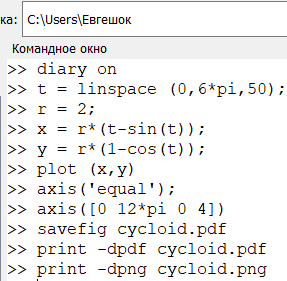{ #fig:001 width=70% }

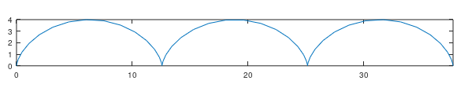{ #fig:002 width=70% }

## **2. Полярные координаты**

Графики в полярных координатах строятся аналогичным образом. Для функции $r = f(\theta)$ мы начинаем с определения независимой переменной $\theta$, затем вычисляем $r$. Чтобы построить график, мы вычислим  $x$ и $y$, используем стандартное преобразование координат

$$x = r cos(\theta), y = r sin(\theta)$$

Затем построим график в осях $xy$.

Построим улитку Паскаля:

$$r= 1 – 2 sin(\theta)$$  

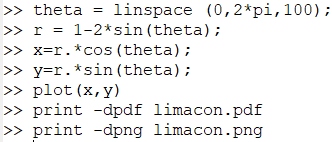{ #fig:003 width=70% }
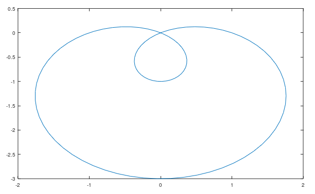{ #fig:004 width=70% }

Более того, можно построить данный график в полярных осях.

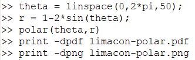{ #fig:005 width=70% }
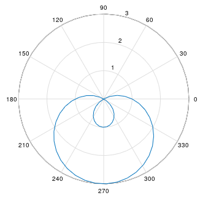{ #fig:006 width=70% }

## ***3. Графики неявных функций***

Пусть нужно построить функцию, неявно определённую уравнением вида 

$$f(x, y) = 0$$

Самый простой способ сделать это в Octave – с помощью команды ezplot.
Построим кривую, определяемую уравнением 

$$ -x^{2}-xy+x+y^{2}-y=1.$$

Чтобы определить функцию в виде $f(x, y) = 0$, вычтем $1$ из обеих частей уравнения. Зададим функцию в виде $\lambda$-функции.

{ #fig:007 width=70% }
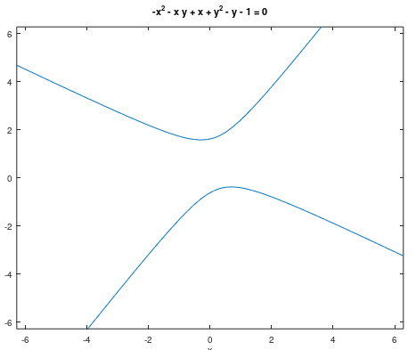{ #fig:008 width=70% }

 Найдём уравнение касательной к графику окружности $$ (x-2)^{2}+y^{2}=25$$ в точке $(-1,4)$. Построим график окружности и касательной $$ y= \frac{3}{4}x+\frac {19}{4}$$

{ #fig:009 width=70% }

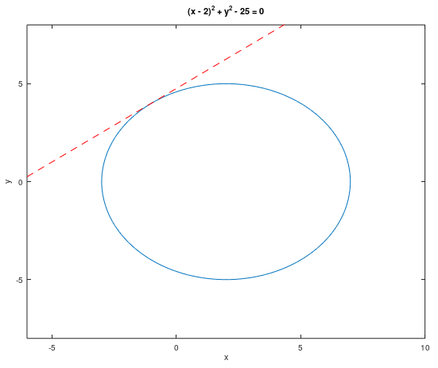{ #fig:010 width=70% }

## ***4. Комплексные числа***

Зададим два комплексных числа и запишем основные арифметические операции с ними: сложение,вычитание,  умножение, деление. 

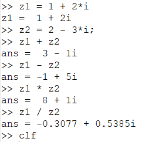{ #fig:011 width=70% }

Построим графики в комплексной плоскости, используя команду compass

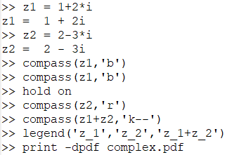{ #fig:012 width=70% }
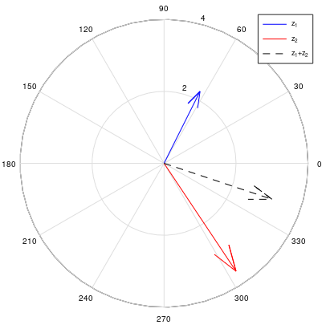{ #fig:013 width=70% }

Иногда мы можем получить странные результаты вывода программы. При вычислении корня третьей степени из -8, мы ожидаем ответ -2, но получаем другое число. Это объясняется тем, что Octave возвращает тот ответ, у которого меньший аргумент. Для того, чтобы получить -2, мы должны использовать команду nthroot.

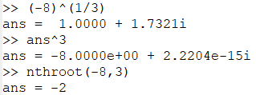{ #fig:014 width=70% }

## **5. Специальные функции**

Построим гамма-функцию Г(х+1) и n! на одном графике, как показано на Fig. 15.  

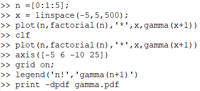{ #fig:015 width=70% }

Изображение показано на Fig. 16.  

{ #fig:016 width=70% }

Разделив область значения на отдельные интервалы, можно убрать артефакты вычислений. Для этого следует выполнить команды, указанные на Fig. 17.  

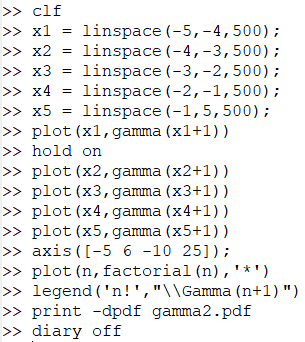{ #fig:017 width=70% }

После проведения вышеуказанных действий, построим график. См. Fig. 18  

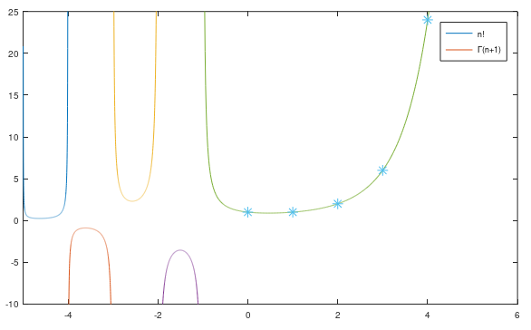{ #fig:018 width=70% }

# Выводы
В ходе выполнения лабораторной работы я научился строить в Octave различные виды графиков: параметрические, неявных функций, в полярных координатах. Также поработал с комплексными числами, научился изображать их на координатной плоскости; построил гамма-функцию и график факториала.