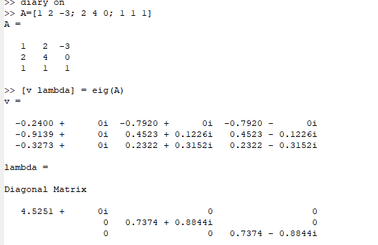
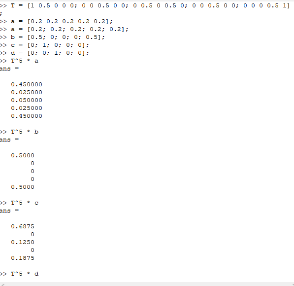
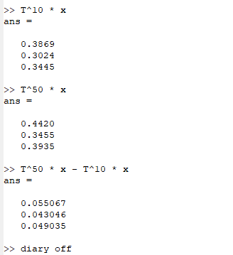

---
## Front matter
lang: ru-RU
title:  Задача на собственные значения
author: Кейела Патачона
institute: Российский Университет Дружбы Народов
date: 26 декабря, 2021, Москва, Россия

## Formatting
mainfont: PT Serif
romanfont: PT Serif
sansfont: PT Sans
monofont: PT Mono
toc: false
slide_level: 2
theme: metropolis
header-includes: 
 - \metroset{progressbar=frametitle,sectionpage=progressbar,numbering=fraction}
 - '\makeatletter'
 - '\beamer@ignorenonframefalse'
 - '\makeatother'
aspectratio: 43
section-titles: true
---

# Цели и задачи

## Цель лабораторной работы

Цель этой работы-посмотреть, как мы определяем собственные значения и собственные векторы с Octave, и увидеть их использование в Марковских процессах и случайных блужданиях в Octave.

## Задание

Найти собственные значения и собственные векторы на Octave.

# Выполнение лабораторной работы

## Собственные значения и собственные векторы 1

Сначала мы определяем собственные значения и собственные векторы с помощью этими операциями.

{ #fig:001 width=60% height=60%}

## Собственные значения и собственные векторы 1

Для того, чтобы получить матрицу с действительными собственными значениями, мы можем создать симметричную матрицу (имеющую действительные собственные значения) путём умножения матрицы и на транспонированную матрицу:

{ #fig:002 width=70% height=70%}

# Марковские цепи и Случайное блуждание

{ #fig:003 width=70% height=70%}

# Марковские цепи и Случайное блуждание

{ #fig:004 width=70% height=70%}

# Марковские цепи и Случайное блуждание

Таким образом, $x=(0.37631 ~~ 0.29287~~ 0.33082)$ является вектором равновесного состояния. Проверим это.

{ #fig:005 width=70% height=70%}

# Вывод

В конце этой работы я узнала, как определять собственные векторы и собственные значения с помощью операций с Octave, а также как использовать их для определения стационарных или граничных точек на марковских процессах и случайном блуждании.
