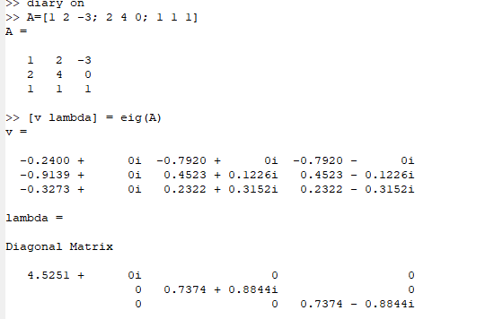
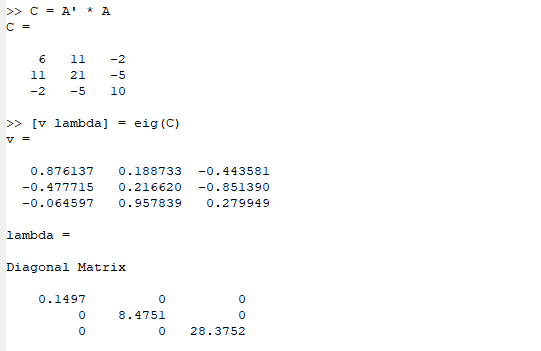
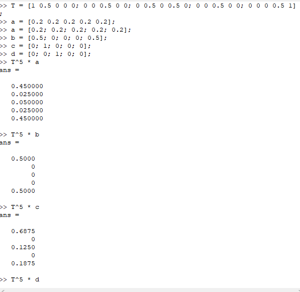
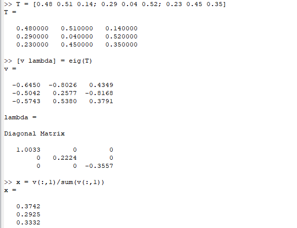
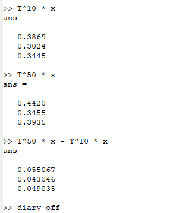

---
# Front matter
lang: ru-RU
title: "Научное програмирование"
subtitle: "Задача на собственные значения"
author: "Кейела Патачона, НПМмд-02-21"

# Formatting
toc-title: "Содержание"
toc: true # Table of contents
toc_depth: 2
lof: true # List of figures
fontsize: 12pt
linestretch: 1.5
papersize: a4paper
documentclass: scrreprt
polyglossia-lang: russian
polyglossia-otherlangs: english
mainfont: PT Serif
romanfont: PT Serif
sansfont: PT Sans
monofont: PT Mono
mainfontoptions: Ligatures=TeX
romanfontoptions: Ligatures=TeX
sansfontoptions: Ligatures=TeX,Scale=MatchLowercase
monofontoptions: Scale=MatchLowercase
indent: true
pdf-engine: lualatex
header-includes:
  - \linepenalty=10 # the penalty added to the badness of each line within a paragraph (no associated penalty node) Increasing the value makes tex try to have fewer lines in the paragraph.
  - \interlinepenalty=0 # value of the penalty (node) added after each line of a paragraph.
  - \hyphenpenalty=50 # the penalty for line breaking at an automatically inserted hyphen
  - \exhyphenpenalty=50 # the penalty for line breaking at an explicit hyphen
  - \binoppenalty=700 # the penalty for breaking a line at a binary operator
  - \relpenalty=500 # the penalty for breaking a line at a relation
  - \clubpenalty=150 # extra penalty for breaking after first line of a paragraph
  - \widowpenalty=150 # extra penalty for breaking before last line of a paragraph
  - \displaywidowpenalty=50 # extra penalty for breaking before last line before a display math
  - \brokenpenalty=100 # extra penalty for page breaking after a hyphenated line
  - \predisplaypenalty=10000 # penalty for breaking before a display
  - \postdisplaypenalty=0 # penalty for breaking after a display
  - \floatingpenalty = 20000 # penalty for splitting an insertion (can only be split footnote in standard LaTeX)
  - \raggedbottom # or \flushbottom
  - \usepackage{float} # keep figures where there are in the text
  - \floatplacement{figure}{H} # keep figures where there are in the text
---
# Цель работы

Цель этой работы $-$ посмотреть, как мы определяем собственные значения и собственные векторы с Octave, и увидеть их использование в Марковских процессах и случайных блужданиях в Octave.

# Задача на собственные значения

## Собственные значения и собственные векторы

Зададим матрицу

$$
A =
\left(
\begin{array}{ccc}
1 & 1 & -3 
\\ 
2 & 4 & 0
\\
1 & 1 & 1
\end{array}
\right)
$$

Необходимо найти собственные значения и собственные векторы этой матрицы. Для нахождения используется команда еіg с двумя выходными аргументами. Синтаксис: $[v \quad Lambda] = eig (A)$

Первый элемент результата есть матрица, столбцы которой представляют собой собственные векторы, а второй результат будет диагональной матрицей с собственными значениями на диагонали.

{ #fig:001 width=70% height=70%}

Для того, чтобы получить матрицу с действительными собственными значениями, мы можем создать симметричную матрицу (имеющую действительные собственные значения) путём умножения матрицы и на транспонированную матрицу:

{ #fig:002 width=70% height=70%}

Здесь диагональные элементы матрицы А являются собственными значениями, а соответствующие столбцы матрицы Vявляются соответствующими собственными векторами. Каждому собственному значению соответствует бесконечное семейство собственных векторов. Типичные собственные векторы, полученные в Octave, нормированы на единицу.

# Марковские цепи

Рассмотрим последовательность случайных событий при соблюдении следующих условий:

- возможно конечное число состояний;
  
- через определённые промежутки времени проводится наблюдение и регистрируется состояние системы;
  
- для каждого состояния мы задаём вероятность перехода в каждое
из остальных состояний или вероятность остаться в том же самом состоянии. Существенным предположением является то, что эти вероятности зависят только от текущего состояния.

Такая система называется цепью Маркова. Наша задача – предсказать вероятности состояний системы.

# Случайное блуждание

Предположим, что мы случайным образом передвигаемся следующим образом. В состояниях 2, 3 или 4 мы перемещаемся влево или вправо наугад. По достижении конца дороги (состояния 1 или 5) мы останавливаемся.

Наша цель – предсказать, где мы окажемся. Начнем с вектора вероятности.

- Предположим, что мы можем начать в любой точке с равной веро
ятностью. Тогда начальный вектор будет $(0.2, 0.2, 0.2, 0.2, 0.2).$

- С другой стороны, мы можем знать начальное состояние. Пред
положим, мы начинаем с состояния 3. Тогда начальный вектор будет $(0, 0, 1, 0, 0).$

Мы хотим предсказать наше местоположение после $k$ ходов. Это делается путём записи переходной матрицы. Сформируем массив $n*n$, элемент $i j$ которого является вероятностью перехода из состояния $i$ в $j$. Пусть $T$ есть транспонированная матрица переходов. Матричное произведение $Tx$ даёт новое распределение вероятностей после одного периода времени. Продолжение умножения на $T$ даёт вероятности для будущих состояний. Таким образом, для любого начального вектора вероятности $x$ и любого положительного целого числа $k$ вектор вероятности после $k$ периодов времени равен 

$$\overrightarrow{y}=T^{k} \overrightarrow{x}$$

Для примера случайного блуждания найдём вектор вероятности после 5 шагов для каждого из следующих начальных векторов вероятности: 

$$a=[0.2 ~~ 0.2 ~~ 0.2 ~~ 0.2 ~~ 0.2]^{T}$$

$$b = [0.5 ~~ 0~~0~~0~~0.5]^{T}$$

$$c = [0~~1~~0~~0~~0]^{T}$$

$$d = [0 ~~0~~1~~0~~0]^{T} $$

Сформируем матрицу переходов:

$$
T =
\left(
\begin{array}{ccccc}
1 & 0.5 & 0 & 0 & 0 
\\ 
0 & 0 & 0.5 & 0 & 0
\\
0 & 0.5 & 0 & 0.5 & 0
\\ 
0 & 0 & 0.5 & 0 & 0
\\ 
0 & 0 & 0 & 0.5 & 1
\end{array}
\right)
$$

{ #fig:003 width=70% height=70%}

Состояние $x$ является равновесным, если $\overrightarrow{x}= T\overrightarrow{x}$, где $T$– матрица перехода для цепи Маркова. Равновесное состояние не приводит к изменению состояния в будущем. Каждая цепь Маркова имеет хотя бы одно равновесное состояние.

Пусть $T$- матрица переходов для цепи Маркова. Тогда $\lambda=1$ является собственным значением $T$. Если $x$ является собственным вектором для $\lambda = 1$ с неотрицательными компонентами, сумма которых равна 1, то является равновесным состоянием для $T$.

Найдём вектор равновесного состояния для цепи Маркова с переходной матрицей

$$
T =
\left[
\begin{array}{ccc}
0.48 & 0.51 & 0.14
\\ 
0.29 & 0.04 & 0.52 
\\ 
0.23 & 0.45 & 0.34
\end{array}
\right]
$$

{ #fig:004 width=70% height=70%}

Таким образом, $x=(0.37631 ~~ 0.29287~~ 0.33082)$ является вектором равновесного состояния. Проверили это.

{ #fig:005 width=70% height=70%}

# Вывод

В конце этой работы я узнала, как определять собственные векторы и собственные значения с помощью операций с Octave, а также как использовать их для определения стационарных или граничных точек на марковских процессах и случайном блуждании.

# Список литературы{.unnumbered}

1. [Инструкция к лабораторной работе №8](https://esystem.rudn.ru/mod/resource/view.php?id=795800)
